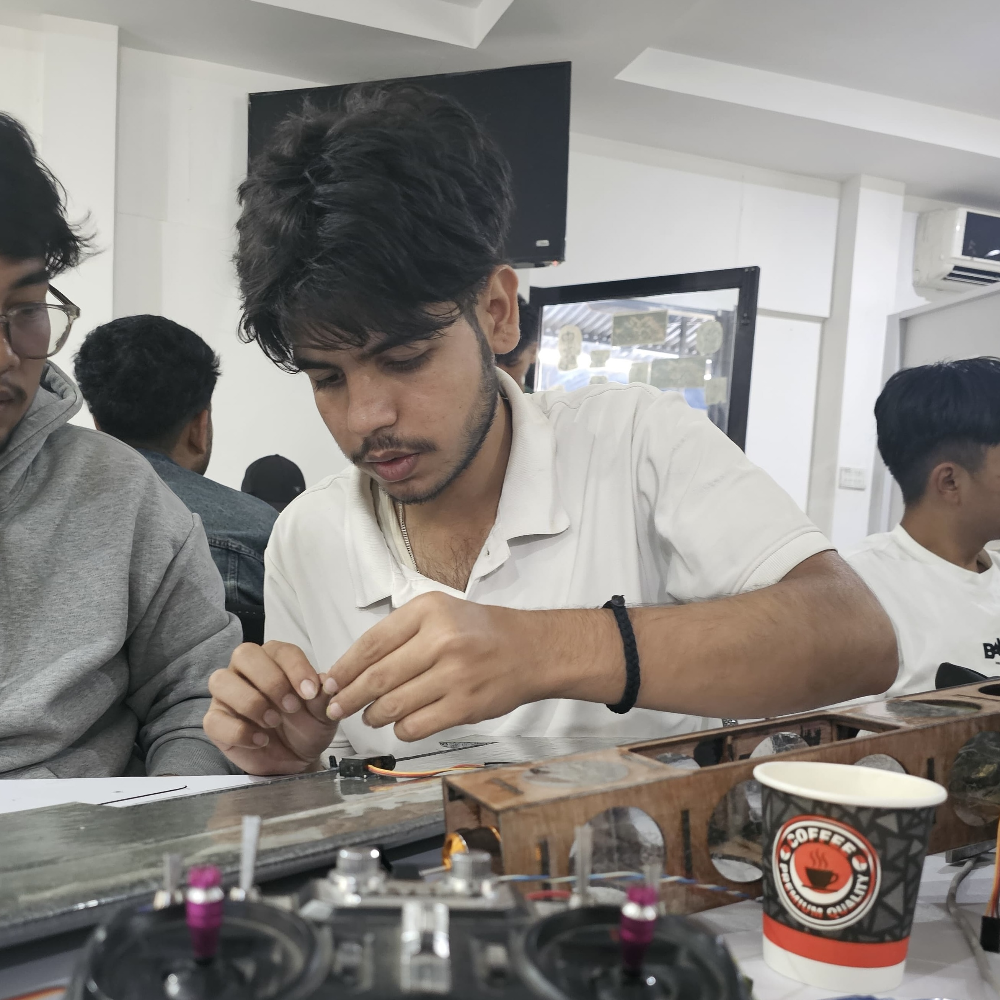

<!-- Profile Banner / Typing Animation -->

  

It's me <a href ="https://www.linkedin.com/in/biplovgautam/" target="_blank">BIplov Gautam<a/> a <b>Computer Science student</b> deeply focused on <b>Artificial Intelligence</b>, <b>Machine Learning</b>, <b>Computer vision</b> and <b>Large Language Models (LLMs)</b>.  
Currently working on <b>RAG pipelines</b>, <b>vector databases</b>, and building <b>AI-driven web apps</b> while sharpening software engineering & project management skills.

- **Learning:** ML, DL, Neural Networks, PyTorch, TensorFlow, RAG Systems.  
- **Focus:** LLMs, LangChain, Pinecone, embeddings, retrieval & chunking.  
- **Ambition:** Design AI systems solving **real-world problems** (healthcare, finance, education).  
- **Goal:** Build impactful **AI-powered products** with scalable architectures.  

## 💻 Tech Stack

  <!-- Hero -->
  

    
    <h1 style="font-weight:600;margin-top:18px;">Biplov Gautam — AI/ML Engineer</h1>
    

      I build human-first AI copilots, retrieval layers, and full-stack experiences that make intelligent systems feel like collaborators (not tools).
    

    
    
    
    
    
  

   

  > “The true sign of intelligence is not knowledge but imagination.” — Albert Einstein

  ---

  ## ⚡️ Snapshot

  | ⚙️ Stack Focus | 🌍 Base | 🎯 Mission | 📬 Collaborations |
  | --- | --- | --- | --- |
  | LLM copilots · Retrieval augmented generation · Evaluation tooling · Vector DBs | Kathmandu, Nepal (UTC+5:45) | Make AI copilots trustworthy, accessible, and delightful | AI infrastructure, automation, intelligent products |

  ---

  ## 🚀 Currently Shipping

  - **JawafAI** · Android messaging copilot that mirrors your tone across inboxes.
  - **BiLearnHub** · GenAI learning platform (AsianHack 2025) powered by Python + Pinecone.
  - **Mindshipping Journal** · Public build-in-public log for experiments & research drops.
  - **Copilot Evaluators** · Retrieval-aware metrics, guardrails, and workflow agents.

  ---

  ## 🧠 Highlight Projects

  <table>
    <tr>
      <td width="33%">
        <strong>JawafAI</strong>
         Context-aware Android messaging companion built with React Native + LangChain.
         <a href="https://github.com/biplovgautam/jawafai">Case study →</a>
      </td>
      <td width="33%">
        <strong>BiLearnHub</strong>
         GenAI study space that pulls session-aware context from Pinecone for precise answers.
         <a href="https://bilearnhub.biplovgautam.com.np">Live demo →</a>
      </td>
      <td width="33%">
        <strong>Lanceraa</strong>
         Full-stack freelancing marketplace (FastAPI + Next.js) shipping soon.
         <a href="https://lanceraa.biplovgautam.com.np">Preview →</a>
      </td>
    </tr>
  </table>

  ---

  ## 🧰 Toolbox

  

    
     
    
  

  

    
    
    
    
  

  ---

  ## 📊 Signal

  

    
     
    
    
  

  ---

  ## � Writing & Mindshare

  - **Mindshipping Log** — build-in-public notes, prototypes, and AI musings → [mindshipping.tech/biplovgautam](https://mindshipping.tech/biplovgautam)
  - **Medium Essays** — practical AI/ML breakdowns & experiments → [madhavbiplov.medium.com](https://madhavbiplov.medium.com)
  - **LinkedIn Drops** — updates on copilots, evaluators, and launches → [linkedin.com/in/biplovgautam](https://www.linkedin.com/in/biplovgautam)

  ---

  ## 🤝 Let’s Build Together

  If you’re exploring AI copilots, automation, or intelligent systems, I’d love to jam on ideas. Open to collaborations, mentorship chats, and cool shipping stories.

  

    <a href="mailto:contact@biplovgautam.com.np">contact@biplovgautam.com.np</a> · <a href="https://biplovgautam.com.np" target="_blank">biplovgautam.com.np</a>
  

